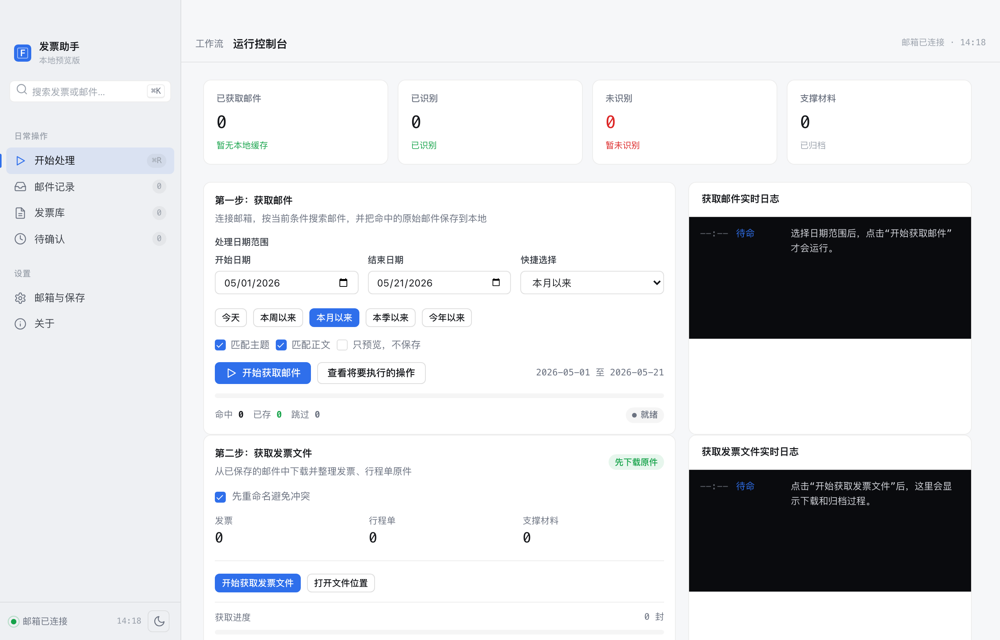
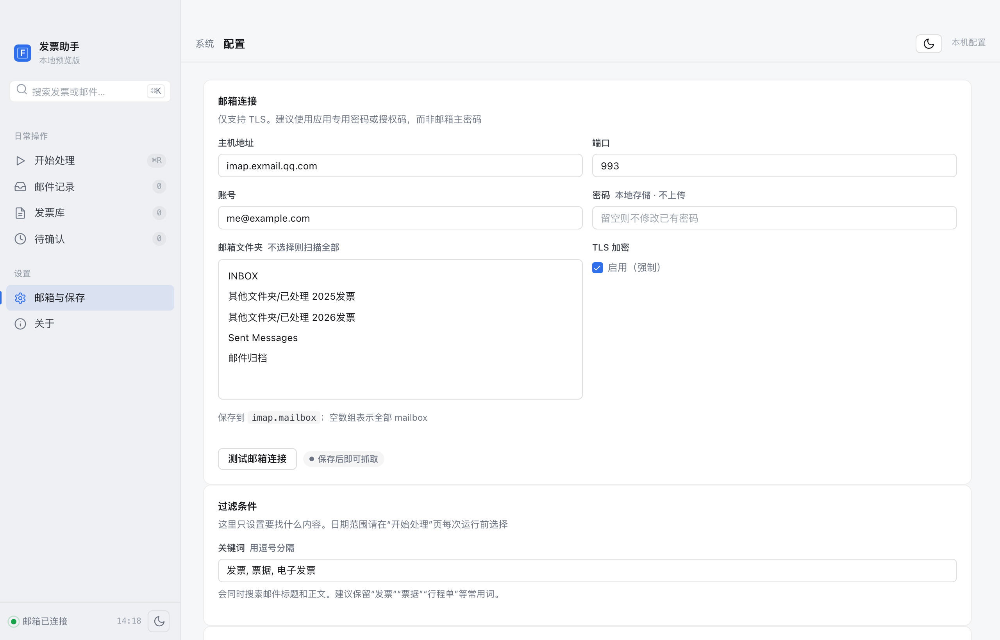
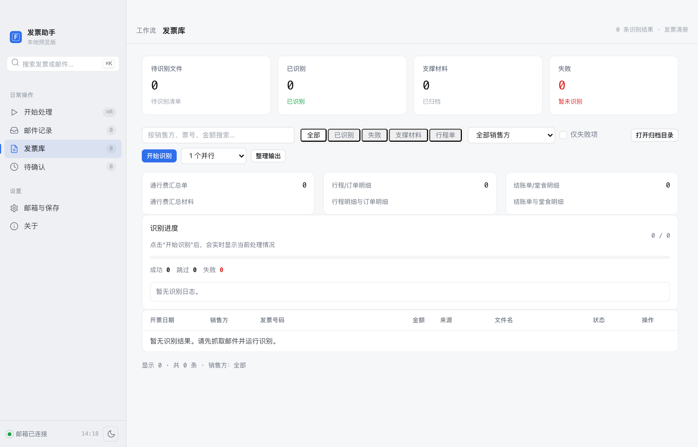
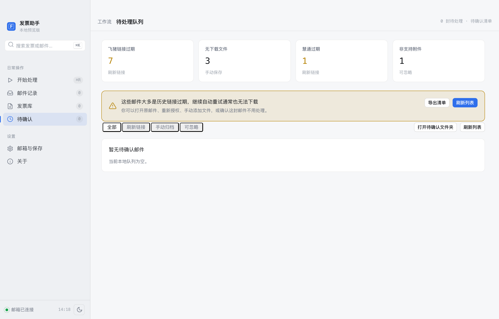
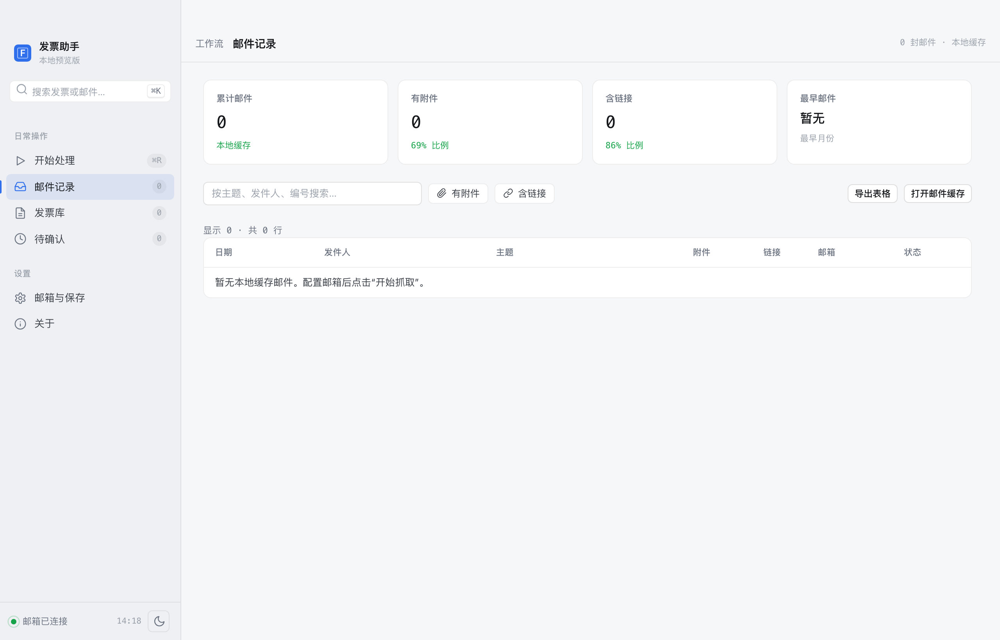
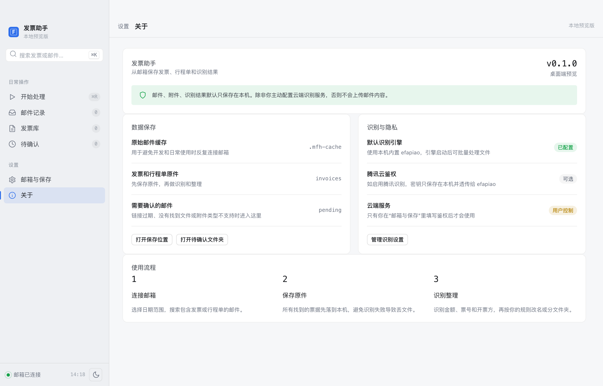

# 发票助手 · Mail Fapiao Helper

> 从你的企业邮箱里自动抓取含"发票"关键字的邮件，下载并归档 PDF / OFD / 图片票据，离线识别票号金额，按你设定的规则改名或分类。**macOS 与 Windows 桌面应用，所有数据保留在本机。**



---

## 目录

- [软件能做什么](#一软件能做什么)
- [下载](#二下载)
- [首次打开（绕过系统拦截）](#三首次打开绕过系统拦截)
- [首次使用](#四首次使用)
- [页面一览](#五页面一览)
- [本机数据保存在哪里](#六本机数据保存在哪里)
- [常见问题](#七常见问题)
- [从源码运行 / 自行打包](#八从源码运行--自行打包)
- [隐私](#九隐私)

---

## 一、软件能做什么

| 场景 | 自动完成的事 |
|---|---|
| 邮箱里堆了一堆带"发票"字样的邮件 | 按关键字 + 日期窗口抓取邮件，缓存到本机 `.eml` |
| 邮件里附了 PDF / OFD 发票 | 抽附件，按"安全文件名 + 冲突重命名"归档到 `invoices/` |
| 邮件正文是发票下载链接 | 自动 HEAD 探测 PDF，直接下载归档 |
| 邮件正文是第三方开票平台跳转 | 用 Playwright 自动跑站点脚本下载（目前覆盖：诺诺、慧通、飞猪等） |
| 票据需要识别字段 | 内置离线 OCR 引擎 [E-Fapiao-OCR](https://github.com/12dora/E-Fapiao-OCR)，识别票号、金额、卖方、日期、文档类型 |
| 想按 `{seller}-{amount}.pdf` 这样改名 | OCR 完成后用规则模板复制一份到整理目录 |
| 链接已过期 / 站点不支持 | 留到 **待确认** 队列里给你手动处理，不会丢邮件 |

整个过程**不会向任何外部服务器上传你的邮件内容**——IMAP 直连你自己的邮箱，OCR 默认走本机引擎。

---

## 二、下载

去本仓库的 **[Releases](../../releases)** 页面，选择最新版本，根据下表挑选安装包：

| 操作系统 | 推荐文件 | 备用 |
|---|---|---|
| macOS（Apple Silicon / M 系芯片） | `发票助手-<version>-arm64.dmg` | `发票助手-<version>-arm64-mac.zip` |
| Windows 10 / 11（x64） | `发票助手 Setup <version>.exe`（带安装向导） | `发票助手-<version>-win.zip`（解压即用） |

**未提供发行版的平台**：

- **Intel Mac（x86_64）**：上游 OCR 引擎未发布 darwin-x86_64 包，请按 [第八节](#八从源码运行--自行打包) 自行构建。
- **Windows ARM64**：x64 版本可在 Win11 ARM 上通过仿真运行，但 OCR 引擎未适配 ARM。
- **Linux**：目前不作为发行目标。

---

## 三、首次打开（绕过系统拦截）

桌面包**未做代码签名**（个人项目无证书），首次启动会被 macOS Gatekeeper / Windows SmartScreen 拦一次。放行一次后即可正常双击使用。

### macOS

1. 双击 `.dmg`，把"发票助手"拖进 **应用程序**。
2. 第一次打开：在"应用程序"里 **按住 Control 点击图标 → 打开**（不要直接双击），在弹窗里再点 **打开**。
3. 如果新版 macOS 提示"已损坏，无法打开"，开一次终端执行：

   ```bash
   xattr -dr com.apple.quarantine "/Applications/发票助手.app"
   ```

   然后回到"应用程序"里双击即可。

### Windows

1. 双击 `发票助手 Setup <version>.exe`，按引导安装。
2. SmartScreen 提示"Windows 已保护你的电脑"时，点 **更多信息 → 仍要运行**。
3. 从开始菜单找到"发票助手"打开。

> 免安装方案：下载 `发票助手-<version>-win.zip`，解压到任意目录，双击 `发票助手.exe`，第一次同样会触发 SmartScreen。

---

## 四、首次使用

### 1. 填写邮箱

进入左侧菜单 **邮箱与保存**，填 IMAP 服务器、端口、邮箱账号、**授权码**（不是邮箱登录密码；常见邮箱在网页里开通 IMAP 服务时会给到一串授权码）。可以勾选要扫描哪些邮件夹。点击 **测试邮箱连接** 验证。



### 2. 抓取邮件

回到 **开始处理** 页，选好日期范围（默认本月以来），点 **开始获取邮件**。命中关键字的邮件会缓存到本机的 `.eml` 文件，不会修改邮箱里的原邮件。


> 第二步 **获取发票文件** 会从本地缓存的邮件中抽取附件、跟踪正文直链、调度第三方站点脚本，把发票文件归档到 `invoices/`。

### 3. 识别字段（可选）

切到 **发票库** 页，点 **开始识别**。内置 OCR 引擎离线识别票号、金额、卖方、日期、文档类型（普票/电子发票/行程单/支撑材料）。可以按发票类型筛选、按销售方搜索，也支持手动重跑 OCR。



### 4. 处理待确认队列

链接过期、平台不支持、附件格式特殊的邮件会自动归档到 **待确认** 队列，并按处置策略分组（可刷新链接 / 手动归档 / 可忽略）。



---

## 五、页面一览

| 页面 | 用途 |
|---|---|
| **开始处理** | 当前主要工作流：获取邮件 → 获取发票文件 → 识别 → 整理 |
| **邮件记录** | 已抓取的邮件清单，可按主题/发件人/编号搜索，可导出表格、定位本地 `.eml` |
| **发票库** | 已归档发票一览，含识别字段、状态、文档类型筛选、整理输出入口 |
| **待确认** | 自动处理失败的邮件分组（链接过期 / 无下载文件 / 平台不支持等），给出原文打开、刷新链接、手动归档、忽略入口 |
| **邮箱与保存** | IMAP 设置、过滤关键字、保存目录、命名规则、整理规则、OCR 引擎配置 |
| **关于** | 版本、隐私说明、本机数据目录入口、识别引擎状态 |

**邮件记录**：



**关于**（含本机数据目录、识别引擎状态、隐私说明）：



---

## 六、本机数据保存在哪里

| 平台 | 路径 |
|---|---|
| macOS | `~/Library/Application Support/发票助手/` |
| Windows | `%APPDATA%\发票助手\` |

目录下包含：

```
config.json            # 邮箱设置、授权码（POSIX 平台已 chmod 600）
state.json             # 已处理邮件状态
samples/raw/           # 抓回的原始 .eml 邮件缓存
invoices/              # 归档的发票原件（PDF / OFD / 图片）
invoices.csv           # 归档清单
invoices/ocr/          # OCR 待识别队列与识别结果
pending/               # 待确认邮件（含原 .eml 与索引）
```

**这些文件全部在你本机**，应用不会上传任何邮件或票据内容。

---

## 七、常见问题

<details>
<summary>macOS 提示"无法打开'发票助手'，因为它来自身份不明的开发者"</summary>

应用程序文件夹里**按住 Control 点击图标 → 打开**，弹窗里再点 **打开**。系统记住后再双击就不会拦。
</details>

<details>
<summary>macOS 提示"应用已损坏，无法打开"</summary>

新版本 macOS 对未签名应用的标准提示。在终端执行：

```bash
xattr -dr com.apple.quarantine "/Applications/发票助手.app"
```

然后再次双击即可。
</details>

<details>
<summary>Windows SmartScreen 阻止运行</summary>

点 **更多信息 → 仍要运行**。
</details>

<details>
<summary>邮箱测试连接失败 / 提示密码错误</summary>

- 确认地址是 **IMAP** 服务器（不是 SMTP），端口通常 993、加密 TLS
- 密码请填邮箱的**授权码 / 应用专用密码**，不是网页登录密码
- 企业邮箱可能需要先在管理后台开通 IMAP 协议
</details>

<details>
<summary>"开始识别"没反应 / 没有待识别文件</summary>

需要先完成"获取邮件 → 获取发票文件"，本机 `invoices/` 目录里有归档文件后才会触发 OCR。
</details>

<details>
<summary>第三方开票平台抓不到票</summary>

第三方站点（诺诺、慧通、飞猪等）走浏览器自动化，需要本机装好 **Chrome 或 Microsoft Edge**（应用安装包没内置 Chromium 以节省体积，运行时会调用系统浏览器）。安装一个即可。

如果是历史链接已过期（飞猪/慧通常见），该邮件会进入 **待确认** 队列，你可以打开原邮件重新申请或手动归档。
</details>

<details>
<summary>Intel Mac / Linux 怎么用</summary>

目前没有发行版，请按下一节"从源码运行"自行构建。
</details>

---

## 八、从源码运行 / 自行打包

### 前置

- Node.js **20+**
- 想用第三方站点功能：本机装好 Chrome 或 Edge（或一次性 `npx playwright install chromium`）

### 启动开发模式

```bash
npm install
npm run electron          # 编译 TS + 以 Electron 模式打开界面
```

仅 CLI 调试：

```bash
npm run build
node dist/index.js fetch      # 抓邮件
node dist/index.js run        # 处理本地缓存邮件
node dist/index.js ocr run    # 识别归档文件
node dist/index.js organize   # 按规则整理输出
```

CLI 读取项目根目录的 `config.json`（参考 `config.example.json`）。

### 打包本地安装包

```bash
npm run dist:mac          # macOS dmg + zip（arm64）
npm run dist:win          # Windows nsis + zip（x64）
```

产物写入 `release/`（已 gitignore）。

### 发布到 GitHub Release

推一个 `v*` tag 即触发 [.github/workflows/release.yml](.github/workflows/release.yml)，在 macOS + Windows runner 上并行构建并把 dmg / zip / exe 上传到对应 tag 的 Release。

### 其他文档

- [docs/ARCHITECTURE.md](docs/ARCHITECTURE.md) — 模块边界、状态机、幂等性、并发模型
- [docs/DESIGN.md](docs/DESIGN.md) — 产品视角的目标、四类邮件处理对照、配置说明
- [docs/PROGRESS.md](docs/PROGRESS.md) — 各阶段实现进度
- [gui-design/README.md](gui-design/README.md) — 桌面界面静态预览方式

---

## 九、隐私

- 所有邮件、附件、识别结果、邮箱配置都保存在你电脑的用户数据目录，应用不上传邮件内容
- `config.json` 含 IMAP 授权码，POSIX 平台写盘时已做 `chmod 600`
- 默认 OCR 走本机离线引擎，**不调用任何云服务**；如要启用腾讯 OCR 或 API Key，需要你在 **邮箱与保存** 页显式填写
- IMAP 仅使用 TLS 加密连接
- 第三方开票平台跳转使用 Playwright 浏览器自动化，默认无头运行，不保留 cookies
