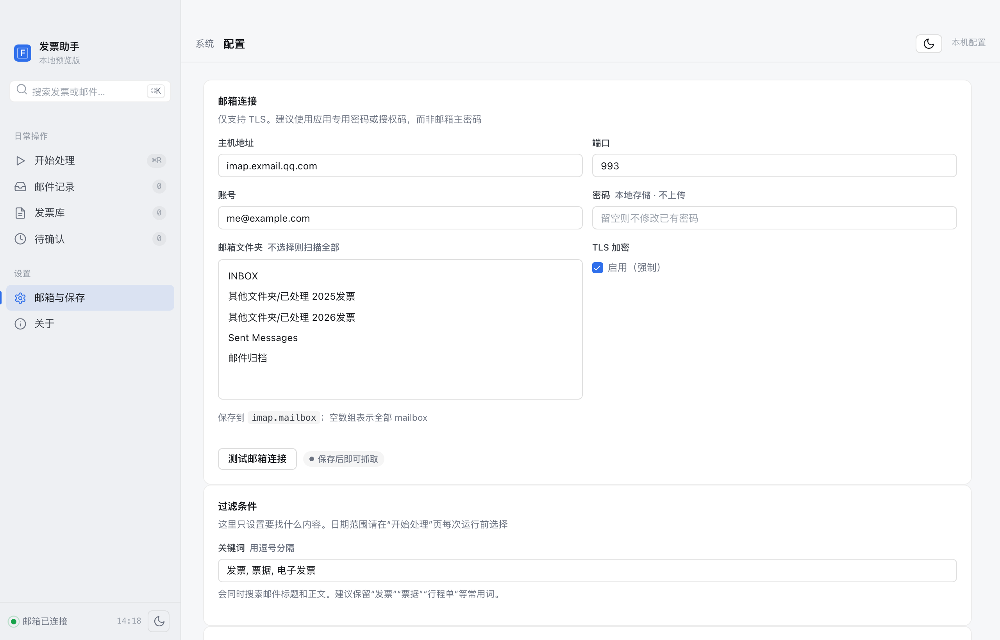
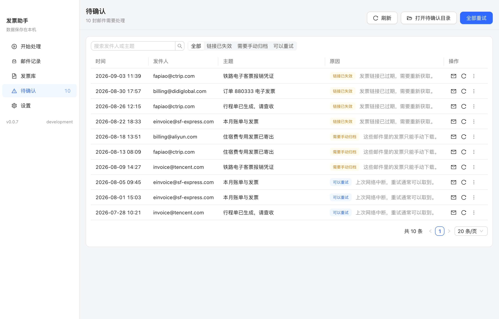
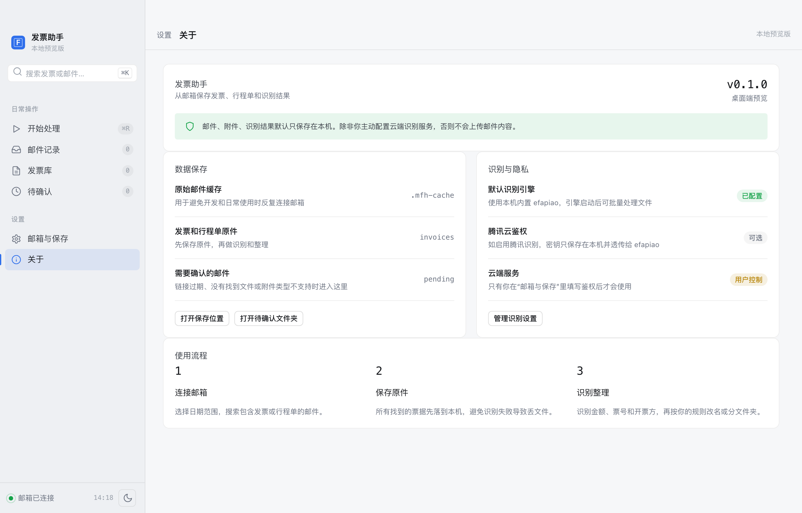

# 发票助手 · Mail Fapiao Helper

> 从你的企业邮箱里自动抓取含"发票"关键字的邮件，下载并归档 PDF / OFD / 图片票据，离线识别票号金额，按你设定的规则改名或分类。**macOS 与 Windows 桌面应用，所有数据保留在本机。**


---

## 目录

- [软件能做什么](#一软件能做什么)
- [下载](#二下载)
- [首次打开](#三首次打开)
- [首次使用](#四首次使用)
- [页面一览](#五页面一览)
- [本机数据保存在哪里](#六本机数据保存在哪里)
- [常见问题](#七常见问题)
- [从源码运行 / 自行打包](#八从源码运行--自行打包)
- [隐私](#九隐私)

---

## 一、软件能做什么

| 场景 | 自动完成的事 |
|---|---|
| 邮箱里堆了一堆带"发票"字样的邮件 | 按关键字 + 日期窗口抓取邮件，缓存到本机 `.eml` |
| 邮件里附了 PDF / OFD 发票 | 抽附件，按"安全文件名 + 冲突重命名"归档到 `invoices/` |
| 邮件正文是发票下载链接 | 自动 HEAD 探测 PDF，直接下载归档 |
| 邮件正文是第三方开票平台跳转 | 用 Playwright 自动跑站点脚本下载（目前覆盖：诺诺、慧通、飞猪等） |
| 票据需要识别字段 | 内置离线 OCR 引擎 [E-Fapiao-OCR](https://github.com/12dora/E-Fapiao-OCR)，识别票号、金额、卖方、日期、文档类型 |
| 想按 `{seller}-{amount}.pdf` 这样改名 | OCR 完成后用规则模板复制一份到整理目录 |
| 链接已过期 / 站点不支持 | 留到 **待确认** 队列里给你手动处理，不会丢邮件 |

整个过程**不会向任何外部服务器上传你的邮件内容**——IMAP 直连你自己的邮箱，OCR 默认走本机引擎。

---

## 二、下载

去本仓库的 **[Releases](../../releases)** 页面，选择最新版本，根据下表挑选安装包：

| 操作系统 | 推荐文件 | 备用 |
|---|---|---|
| macOS（Apple Silicon / M 系芯片） | `发票助手-<version>-arm64.dmg` | `发票助手-<version>-arm64-mac.zip` |
| Windows 10 / 11（x64） | `发票助手 Setup <version>.exe`（带安装向导） | `发票助手-<version>-win.zip`（解压即用） |

**未提供发行版的平台**：

- **Intel Mac（x86_64）**：上游 OCR 引擎未发布 darwin-x86_64 包，请按 [第八节](#八从源码运行--自行打包) 自行构建。
- **Windows ARM64**：x64 版本可在 Win11 ARM 上通过仿真运行，但 OCR 引擎未适配 ARM。
- **Linux**：目前不作为发行目标。

---

## 三、首次打开

### 两种发布通道（请先认准再下载）

GitHub [Releases](../../releases) 上可能同时存在：

> ### ⚠️ 当前所有安装包都是**未签名**的
>
> 本仓库尚未配置代码签名证书（Apple Developer ID + 公证、Windows Authenticode），
> 因此**包括标记为 Latest 的正式 Release 在内**，所有安装包都未签名、未公证。
> 资产文件名一律带 `-unsigned` 后缀，发布标题写明「未签名」。
>
> 这意味着**系统无法替你验证安装包的来源和完整性**：macOS Gatekeeper 与
> Windows SmartScreen 会拦截，且这些警告是真实有效的信号，不是误报。
> 安装前请自行核对发布说明里的 SHA-256 校验值。公司/受管电脑不建议安装。

| 通道 | 如何识别 | 签名 | 适用场景 |
|---|---|---|---|
| **正式 Release（当前）** | GitHub 标记为 Latest；tag 形如 `v0.0.6`；标题含「未签名」；资产名含 `-unsigned` | **未签名、未公证** | 个人本机使用 |
| **未签名 prerelease** | GitHub 标记为 **Pre-release**；tag 含 `-unsigned.N` | **未签名、未公证** | 内测 |
| **开发构建 artifact** | 不在 Releases；只在 Actions workflow 产物里（约 14 天） | 未签名 | 本地联调 |

签名通道的流水线（`.github/workflows/release.yml`）仍然保留且**保持 fail-closed**：
它会逐个产物跑 `codesign --verify --deep --strict`、`spctl --assess`、`stapler validate`
与 Authenticode 校验，任一项不过就拒绝发布。等证书 secrets 配好后，把该 workflow 顶部
被注释掉的 `push.tags` 触发器恢复，正式通道即可重新签名发布；届时本节需要同步更新。

### 如果你拿到的是未签名包（prerelease、开发构建，或本项目早期版本）

未签名包意味着**系统无法替你验证来源和完整性**，Gatekeeper / SmartScreen 的警告是真实有效的信号，不是误报。

- 请只从本仓库下载，并核对 commit；不要从转发的网盘、群文件安装。
- **受管设备、公司电脑、处理敏感票据的机器不要安装未签名构建**——当前没有已签名的安装包可用，请按 [第八节](#八从源码运行--自行打包) 自行从源码构建。
- macOS：在"应用程序"里 **按住 Control 点击图标 → 打开**（不要直接双击），弹窗里再点 **打开**。系统记住这一次授权后即可正常使用。
- Windows：SmartScreen 提示时，先确认文件来源，再点 **更多信息 → 仍要运行**。

> **不要**执行 `xattr -dr com.apple.quarantine` 之类的递归命令去"修好"它。那会把整个目录下所有文件的隔离标记一起清掉——包括你并不打算信任的东西——而且会掩盖掉真正的损坏/篡改提示。上面的"右键 → 打开"只对这一个 app 生效，是范围最小的做法。
>
> 如果右键打开后系统仍然坚持"已损坏"，请把下载的文件删掉重新下载：这通常说明文件在传输中被截断或被改动过。

### 安装步骤

- **macOS**：双击 `.dmg`，把"发票助手"拖进 **应用程序**，然后双击打开。
- **Windows**：双击 `发票助手 Setup <version>.exe`，按引导安装，从开始菜单打开。

> 免安装方案：下载 `发票助手-<version>-win.zip`，解压到任意目录，双击 `发票助手.exe`，第一次同样会触发 SmartScreen。

---

## 四、首次使用

### 1. 填写邮箱

进入左侧菜单 **邮箱与保存**，填 IMAP 服务器、端口、邮箱账号、**授权码**（不是邮箱登录密码；常见邮箱在网页里开通 IMAP 服务时会给到一串授权码）。可以勾选要扫描哪些邮件夹。点击 **测试邮箱连接** 验证。



### 2. 抓取邮件

回到 **开始处理** 页，选好日期范围（默认本月以来），点 **开始获取邮件**。命中关键字的邮件会缓存到本机的 `.eml` 文件，不会修改邮箱里的原邮件。


> 第二步 **获取发票文件** 会从本地缓存的邮件中抽取附件、跟踪正文直链、调度第三方站点脚本，把发票文件归档到 `invoices/`。

### 3. 识别字段（可选）

切到 **发票库** 页，点 **开始识别**。内置 OCR 引擎离线识别票号、金额、卖方、日期、文档类型（普票/电子发票/行程单/支撑材料）。可以按发票类型筛选、按销售方搜索，也支持手动重跑 OCR。


### 4. 处理待确认队列

链接过期、平台不支持、附件格式特殊的邮件会自动归档到 **待确认** 队列，并按处置策略分组（可刷新链接 / 手动归档 / 可忽略）。



---

## 五、页面一览

| 页面 | 用途 |
|---|---|
| **开始处理** | 当前主要工作流：获取邮件 → 获取发票文件 → 识别 → 整理 |
| **邮件记录** | 已抓取的邮件清单，可按主题/发件人/编号搜索，可导出表格、定位本地 `.eml` |
| **发票库** | 已归档发票一览，含识别字段、状态、文档类型筛选、整理输出入口 |
| **待确认** | 自动处理失败的邮件分组（链接过期 / 无下载文件 / 平台不支持等），给出原文打开、刷新链接、手动归档、忽略入口 |
| **邮箱与保存** | IMAP 设置、过滤关键字、保存目录、命名规则、整理规则、OCR 引擎配置 |
| **关于** | 版本、隐私说明、本机数据目录入口、识别引擎状态 |

**邮件记录**：


**关于**（含本机数据目录、识别引擎状态、隐私说明）：



---

## 六、本机数据保存在哪里

| 平台 | 路径 |
|---|---|
| macOS | `~/Library/Application Support/发票助手/` |
| Windows | `%APPDATA%\发票助手\` |

目录下包含：

```
config.json            # 邮箱设置、授权码（POSIX 平台已 chmod 600）
state.json             # 已处理邮件状态
samples/raw/           # 抓回的原始 .eml 邮件缓存
invoices/              # 归档的发票原件（PDF / OFD / 图片）
invoices.csv           # 归档清单
invoices/ocr/          # OCR 待识别队列与识别结果
pending/               # 待确认邮件（含原 .eml 与索引）
```

**这些文件全部在你本机**，应用不会上传任何邮件或票据内容。

---

## 七、常见问题

<details>
<summary>macOS 提示"无法打开'发票助手'，因为它来自身份不明的开发者"</summary>

应用程序文件夹里**按住 Control 点击图标 → 打开**，弹窗里再点 **打开**。系统记住后再双击就不会拦。
</details>

<details>
<summary>macOS 提示"应用已损坏，无法打开"</summary>

当前所有安装包都未签名（见 [第二节](#两种发布通道请先认准再下载)），因此这个提示是**预期会出现的**，
并不代表文件一定损坏。但它同时也是"文件在下载中被改动"的真实信号——**先核对发布说明里的
SHA-256 校验值再放行**：

```bash
shasum -a 256 ~/Downloads/mail-fapiao-helper-0.0.6-arm64-unsigned.dmg
```

校验值一致后，正确做法是：在"应用程序"里 **按住 Control 点击图标 → 打开**，弹窗里再点 **打开**。
这只对这一个 app 放行。

**请不要**用 `xattr -dr com.apple.quarantine <目录>` 递归清除隔离标记：它会连带信任你没打算信任的文件，并且会让真正的"文件损坏/被篡改"提示也一并消失。

如果右键打开仍然失败，说明文件很可能在下载中损坏或被改动——删掉重新从 [Releases](../../releases) 下载，并核对发布说明里的 commit。
</details>

<details>
<summary>Windows SmartScreen 阻止运行</summary>

点 **更多信息 → 仍要运行**。
</details>

<details>
<summary>邮箱测试连接失败 / 提示密码错误</summary>

- 确认地址是 **IMAP** 服务器（不是 SMTP），端口通常 993、加密 TLS
- 密码请填邮箱的**授权码 / 应用专用密码**，不是网页登录密码
- 企业邮箱可能需要先在管理后台开通 IMAP 协议
</details>

<details>
<summary>"开始识别"没反应 / 没有待识别文件</summary>

需要先完成"获取邮件 → 获取发票文件"，本机 `invoices/` 目录里有归档文件后才会触发 OCR。
</details>

<details>
<summary>第三方开票平台抓不到票</summary>

第三方站点（诺诺、慧通、飞猪等）走浏览器自动化，需要本机装好 **Chrome 或 Microsoft Edge**（应用安装包没内置 Chromium 以节省体积，运行时会调用系统浏览器）。安装一个即可。

如果是历史链接已过期（飞猪/慧通常见），该邮件会进入 **待确认** 队列，你可以打开原邮件重新申请或手动归档。
</details>

<details>
<summary>Intel Mac / Linux 怎么用</summary>

目前没有发行版，请按下一节"从源码运行"自行构建。
</details>

---

## 八、从源码运行 / 自行打包

### 前置

- Node.js **20+**
- 想用第三方站点功能：本机装好 Chrome 或 Edge（或一次性 `npx playwright install chromium`）

### 启动开发模式

```bash
npm install
npm run electron          # 编译 TS + 以 Electron 模式打开界面
```

仅 CLI 调试：

```bash
npm run build
node dist/index.js fetch      # 抓邮件
node dist/index.js run        # 处理本地缓存邮件
node dist/index.js ocr run    # 识别归档文件
node dist/index.js organize   # 按规则整理输出
```

CLI 读取项目根目录的 `config.json`（参考 `config.example.json`）。

### 跑测试

```bash
npm test                  # build + typecheck + CLI 回归 + Electron 端到端
npm run test:browser      # 渲染进程 E2E，需要 Playwright Chromium，单独跑
```

每个 `test:*` 前都会执行 `scripts/check-test-prereqs.mjs` 做前置检查（是否已编译、Electron 二进制是否安装、Chromium 是否就位、Linux 上有没有显示服务）。**缺少前置条件时会直接失败并说明原因，不会静默跳过。** Linux 上跑 GUI 相关套件请用 `xvfb-run -a npm test`。

### 打包本地安装包

```bash
npm run dist:mac          # macOS dmg + zip（arm64），未签名开发构建
npm run dist:win          # Windows nsis + zip（x64），未签名开发构建
npm run verify:artifacts -- --platform mac --channel development
```

产物写入 `release/`（已 gitignore）。

打包经由 [scripts/build-release.mjs](scripts/build-release.mjs)，它区分两个**构建通道**（再由不同 workflow 决定是否进 Releases）：

| 通道 | 用在哪 | 签名要求 | 产物去向 |
|---|---|---|---|
| `development`（默认） | 本地 `npm run dist:*`、`dev-build.yml`、`unsigned-prerelease.yml` | 不签名；macOS 只做 ad-hoc 签名以便 arm64 能启动；文件名强制加 `-unsigned` | `dev-build`：仅 workflow artifact（约 14 天）。`unsigned-prerelease`：可发布为 **GitHub Pre-release**（明确未签名） |
| `stable` | `release.yml`（仅 `vMAJOR.MINOR.PATCH` tag） | **强制**签名 + 公证（macOS）+ 时间戳（Windows），缺任一项在打包前就失败 | 正式 GitHub Release（`prerelease: false`） |

`npm run verify:artifacts` 除了拒绝异平台可执行文件、异平台 OCR 引擎、测试代码和 dev fake backend，还会按通道校验信任级别：

- `--channel stable`：macOS 跑 `codesign --verify --deep --strict`、断言非 ad-hoc 签名 + 有 Team ID + hardened runtime、`spctl --assess`、`stapler validate`，并单独校验嵌套的 efapiao OCR 二进制和 `.dmg`；Windows 校验每个 `.exe` 的 Authenticode 状态为 `Valid` 且有时间戳反签名。任一项失败即失败。
- `--channel development`：断言产物**确实**是未签名的（build-info、文件名、ad-hoc 签名三者一致），避免开发构建被误当成正式发布。

macOS 签名用的 entitlements 在 [build/entitlements.mac.plist](build/entitlements.mac.plist)（hardened runtime + 嵌套 OCR 二进制所需的 library validation 豁免）。

### 持续集成

- [.github/workflows/ci.yml](.github/workflows/ci.yml) — 每个 PR 和 push 到 main：在 macOS + Windows 上跑 `npm audit --omit=dev` 与 `npm run test:core`；Chromium 浏览器 E2E 为独立 job。
- 分支保护：CI  alone 不能阻止失败合并——需在 GitHub 配置 required checks，见 [docs/BRANCH_PROTECTION.md](docs/BRANCH_PROTECTION.md)（需 owner 操作）。
- [.github/workflows/dev-build.yml](.github/workflows/dev-build.yml) — 手动触发的**未签名开发构建**。`permissions: contents: read`，产物只上传为 workflow artifact（保留 14 天）。
- [.github/workflows/unsigned-prerelease.yml](.github/workflows/unsigned-prerelease.yml) — tag `vX.Y.Z-unsigned.N` 的**明确未签名 Pre-release**。
- [.github/workflows/release.yml](.github/workflows/release.yml) — **正式签名发布**，见下。

### 发布到 GitHub Release

#### 稳定通道

推一个 **纯** `vMAJOR.MINOR.PATCH` tag（无 `-beta` / `-unsigned` 等后缀）即触发 [.github/workflows/release.yml](.github/workflows/release.yml)。也可以用 `workflow_dispatch` 手动指定同类 tag。流水线先做校验，任一项不过就中止：

1. **签名 secrets 必须齐全**——缺证书或公证凭据时在最便宜的 `resolve` job 直接失败，并提示改用 dev-build / unsigned-prerelease。正式 Release 不存在「降级为未签名」这条路径；
2. tag 必须**已经存在**于远端，并解析成唯一的 commit SHA；
3. tag 必须是稳定 semver（`v1.2.3`），且与该 commit 上 `package.json` 的 `version` 一致（version 亦不得含 prerelease 后缀）；
4. 该 tag 不能已经有已发布的 Release（避免悄悄替换用户已下载的二进制）；
5. 所有 matrix job 用 `actions/checkout` 显式 checkout 同一个 commit SHA，构建完成后再次确认 tag 没有被移动；
6. 打包前跑 `test:core` + `test:browser`；打包后逐产物做严格签名校验；发布说明生成器再次确认所有 build-info 都是 `channel=stable` 且已签名已公证，否则拒绝发布。

#### 未签名 prerelease 通道

使用 [.github/workflows/unsigned-prerelease.yml](.github/workflows/unsigned-prerelease.yml) 与 tag 形如 `v0.0.5-unsigned.1`。发布为 `prerelease: true`，资产名含 `-unsigned`，**没有**开发者签名背书。

解析出的 commit SHA 会写进发布说明，和每个平台的签名状态一起展示（见 [scripts/compose-release-notes.mjs](scripts/compose-release-notes.mjs)）。

正式发布所需的 secrets（**全部必需**；未配置时 release workflow 会明确失败，而不是产出未签名包）：

| Secret | 用途 |
|---|---|
| `MACOS_CERTIFICATE_P12` / `MACOS_CERTIFICATE_PASSWORD` | macOS Developer ID 证书（base64 的 .p12）与密码 |
| `APPLE_API_KEY_BASE64` / `APPLE_API_KEY_ID` / `APPLE_API_ISSUER` | App Store Connect API key 公证（推荐） |
| `APPLE_ID` / `APPLE_APP_SPECIFIC_PASSWORD` / `APPLE_TEAM_ID` | Apple ID 公证（上面那组的替代） |
| `WINDOWS_CERTIFICATE_PFX` / `WINDOWS_CERTIFICATE_PASSWORD` | Windows Authenticode 证书（base64 的 .pfx）与密码 |

### 用 Docker 跑 CLI

桌面端需要图形栈，不适合容器化；**容器里跑的是 CLI**（`fetch` / `run` / `ocr` / `pending` / `organize`），适合放在服务器上定时抓票。

```bash
# 1. 准备宿主机数据目录（已在 .gitignore 里，不会被提交）
mkdir -p data && cp config.example.json data/config.json
#    编辑 data/config.json，填 imap.host / imap.user / imap.pass

# 2. 构建镜像
docker build -t mail-fapiao-helper:latest .

# 3. 抓邮件 → 归档
docker run --rm -v "$PWD/data:/data" mail-fapiao-helper:latest fetch --config /data/config.json
docker run --rm -v "$PWD/data:/data" mail-fapiao-helper:latest run   --config /data/config.json
```

或者用 `docker compose`（等价，少打点字）：

```bash
docker compose --profile cli run --rm mfh fetch --config /data/config.json
docker compose --profile cli run --rm mfh run   --config /data/config.json
```

要点：

- 邮件、附件、`state.json`、`config.json` 全部落在挂载的 `/data` 卷里，**镜像本身不含任何用户数据**；容器以非 root 的 `node` 用户运行。
- 镜像内已装好 Playwright + Chromium，第三方开票平台的站点脚本可以正常跑。
- **OCR 在容器里默认不可用**：`vendor/efapiao/` 只内置了 `darwin-arm64` 与 `windows-x86_64` 两个平台的引擎，上游未发布 Linux 包。如果你自行构建了 Linux 引擎，把它放到 `vendor/efapiao/0.1.3/linux-x86_64/efapiao` 再重新 `docker build` 即可；否则请在配置里把 `ocr.enabled` 设为 `false`，或改用腾讯 OCR。
- 容器不监听任何端口，只需要出站网络访问你的 IMAP 服务器与开票平台。

### 其他文档

- [docs/ARCHITECTURE.md](docs/ARCHITECTURE.md) — 当前模块边界、事务、锁、schema v3
- [docs/DESIGN.md](docs/DESIGN.md) — 产品目标、四类邮件对照、配置指引
- [docs/BRANCH_PROTECTION.md](docs/BRANCH_PROTECTION.md) — main 必过检查（需 owner 配置）
- [docs/SECURITY_NOTES.md](docs/SECURITY_NOTES.md) — 已知残留风险与接受理由
- [docs/SECURITY_HISTORY_CLEANUP.md](docs/SECURITY_HISTORY_CLEANUP.md) — 历史隐私净化步骤（**未执行**，需人工批准）
- [gui-design/README.md](gui-design/README.md) — 桌面界面静态预览；截图可用 `npm run screenshots`（需先本地静态服务器）
- 过程性/历史文档已移至 `docs/archive/` 与 `docs/audit-2026-07-29/`，不作为现行规约

---

## 九、隐私

- 所有邮件、附件、识别结果、邮箱配置都保存在你电脑的用户数据目录，应用不上传邮件内容
- `config.json` 含 IMAP 授权码，POSIX 平台写盘时已做 `chmod 600`
- 默认 OCR 走本机离线引擎，**不调用任何云服务**；如要启用腾讯 OCR 或 API Key，需要你在 **邮箱与保存** 页显式填写
- IMAP 仅使用 TLS 加密连接
- 第三方开票平台跳转使用 Playwright 浏览器自动化，默认无头运行，不保留 cookies
