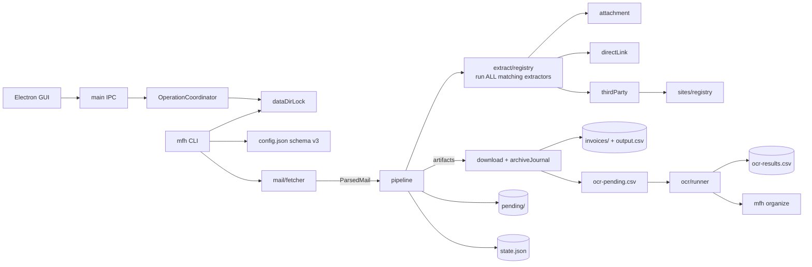

# Mail Fapiao Helper — 架构文档

> 本文是当前实现的**上层规约**（与 `src/` 冲突时以源码为准，并应回写本文）。
> 上次按 2026-07 生产代码重写：组合 extractor、archive journal、schema v3、数据目录锁、Electron。

## 1. 架构总览

**边界**：

- `mail/`：IMAP I/O 与 `ParsedMail`，不含发票语义。
- `extract/`：运行**所有匹配**的 extractor 并组合结果（不是“首个匹配即停”）。
- `download/` + `archiveJournal`：原始文档唯一落盘者；文件安装 + 双 CSV 追加是 journal 事务。
- `ocr/`：归档后识别；`provider: mock` 仅当 `MFH_ALLOW_MOCK_OCR=1`。
- `rename/`：OCR 后可选整理；不移动首轮归档。
- `electron/`：桌面壳、IPC、`OperationCoordinator`、摘要；与 CLI 共用 data-dir 锁协议。
- `state.ts`：唯一 `state.json` 读写者。

## 2. 核心不变量

### 2.1 幂等与身份

- 邮件身份：`msgIdHash` — 有 raw 时 32 位 hex（`sha256(mid + "\\0" + sha256(raw))` 前 32）；无 raw 时保留历史 12 位 sha1（台账重算）。
- 归档协调键：`(messageId, source, contentHash)`，不是单独的 `messageId + source`。
- 票据身份：`hash + filename + contentHash`（见 `util/identity.ts`）。

### 2.2 归档事务（APP-03）

阶段（`<invoicesDir>/.journal/<txId>.json`，fsync）：

| stage | 崩溃后恢复 |
|---|---|
| `prepared` | 仅删除能证明属于本事务的文件 |
| `files-installed` | 删文件 + 截断 CSV 到 baseLength |
| `ledger-committed` | 视为完成，只清 journal |

### 2.3 并发与锁

- CLI 与 GUI 共用 `util/dataDirLock.ts`（`<dataDir>/.mfh-cache/mfh-data.lock`）。
- 所有权只认 **token**（`MFH_LOCK_TOKEN` / `MFH_LOCK_JOB_ID` 继承）；不认 ppid。
- `OperationCoordinator`：fetch / pipeline / ocr / organize **全部互斥**（`COMPATIBLE_WITH` 目前为空数组）。

### 2.4 配置 schema v3

权威形状见仓库根 `config.example.json`。**不要**在文档中复制第二份 JSON。

已删除字段（加载时迁移丢弃）：`output.dir`、`output.pendingDir`、`llm`、`playwright.browserManagement`。

`output` 仅含 `csv`；归档目录与 pending 目录来自 `paths.*`。

### 2.5 渲染层

单页应用：`gui-design/index.html` 是**唯一**页面，React 18 + Ant Design 5，由
esbuild 打包成 `gui-design/dist/app.js` + `app.css`。不走 CDN，CSP 只允许 `'self'`。

- **路由**：只走 hash——`#/dashboard`、`#/inbox`、`#/library`、`#/pending`、`#/settings`
  （设置页另有 `#/settings/<mail|storage|ocr|about>`，发票库跳邮件用 `#/inbox/<mailHash>`）。
  换成 `pushState` 会产生新的 `file:` 路径，`isCanonicalAppPageUrl` 拒绝之后所有 IPC 都会被
  trusted-sender 挡掉。
- **桥接中心**：`preload.cjs` 每个通道 `removeAllListeners` 后只留一个监听器，所以
  `bridge/bridge.ts` 在启动时统一订阅一次再向组件扇出。组件不允许直接碰
  `window.mfhBridge`。
- **假桥接**：`bridge/fake/` 在没有 `window.mfhBridge` 或带 `?fake=…` 时接管全部通道，
  用于浏览器预览、截图与浏览器 E2E：`?fake=1` 正常一屏，`?fake=empty` 空状态，
  `?fake=broken` 配置损坏。**只在渲染层，主进程里没有对应物。**
- **新增 IPC 通道**：`mfh:open-mail`、`mfh:mail-detail`、`mfh:invoice-detail`、`mfh:dedupe`、
  `mfh:open-external`、`mfh:pick-directory`、`mfh:export-csv`。主进程未实现时
  `bridge.supports(name)` 返回 false，界面隐藏入口而不是摆一个点不动的按钮。

### 2.6 浏览器策略

CLI **不会**自动 `npx playwright install`。桌面版也不“随应用准备浏览器”；第三方站点需要本机已安装 Chromium。见 `src/index.ts` 启动检查。

### 2.7 发布通道

| 通道 | 入口 | 签名 | GitHub |
|---|---|---|---|
| stable | `release.yml` + `vMAJOR.MINOR.PATCH` | 强制签名/公证 | 正式 Release |
| development / unsigned | `dev-build.yml` / `unsigned-prerelease.yml` | 未签名 | artifact 或 **prerelease** |

## 3. 模块地图

| 路径 | 职责 |
|---|---|
| `src/index.ts` | CLI 入口、锁获取、命令分发 |
| `src/pipeline.ts` | 单封邮件处理、归档事务、pending 降级 |
| `src/extract/registry.ts` | 组合全部匹配 extractor |
| `src/download/archiveJournal.ts` | 持久化事务与恢复 |
| `src/util/dataDirLock.ts` | 跨进程数据目录锁 |
| `src/util/urlPolicy.ts` · `ipPolicy.ts` · `resolverProfile.ts` | SSRF 主防线：逐跳校验 + DNS pin + 解析器画像 |
| `src/cli/pending.ts` | 待确认队列查看与批量重放（`pending list` / `pending retry`） |
| `src/electron/opCoordinator.ts` | GUI 操作互斥 + 租约下发 |
| `src/electron/main.ts` | Electron 主进程 / IPC |
| `gui-design/src/` | 渲染层（React + antd，esbuild 打包成 `gui-design/dist/`） |
| `gui-design/tests/` | GUI 与 CLI 的 Playwright / Node 测试套件 |

## 4. 测试门禁

| 脚本 | 覆盖 |
|---|---|
| `npm run test:cli` | CLI 回归与集成（真实管线） |
| `npm run test:electron` | 真 Electron 冒烟 + IPC fixture（假 CLI）+ 单元套件 |
| `npm run test:browser` | 渲染层浏览器 E2E（Chromium + 假桥接） |
| `npm run test:core` | lint + tooling + build + typecheck + CLI + Electron |
| `npm run test:all` | core + browser |

三套 GUI 套件共用 `gui-design/tests/ui-helpers.mjs`：`data-testid` 选择器、antd 专属选择器、
界面文案检查、静态服务器，以及 Electron 的临时数据目录与启动。渲染层的 `data-testid`
清单在 `gui-design/src/README.md`。

发布 workflow 必须跑 `test:core` **与** `test:browser`。

## 5. 历史决策（ADR 摘要）

| 日期 | 决策 |
|---|---|
| 2026-05 | 文件型状态，无数据库 |
| 2026-07 | Electron 桌面壳；schema v3；archive journal；data-dir 锁 token 继承 |
| 2026-07 | mock OCR 需 `MFH_ALLOW_MOCK_OCR=1`；邮件 hash 扩至 32 hex（有 raw 时） |
| 2026-09 | SSRF 判定引入解析器画像（`src/util/resolverProfile.ts`）：fake-IP 代理把公网域名映射进 `198.18.0.0/15` 等占位段时，仅放行**域名解析结果**；内网段与 IP 字面量始终拒绝，`MFH_RESERVED_IP_POLICY=strict` 可关闭 |
| 2026-09 | `ExtractIssue.incidental`：票已归档时，仅由「本来就不是发票」的目标（追踪链接、数电 XML 副本）造成的失败不再降级为部分成功；`mfh pending retry` 批量重放待确认队列 |
| 2026-09 | ZIP 解包支持一层嵌套（`MAX_ZIP_NESTING_DEPTH=2`，票根网通行费「包中包」），预算跨层共享；同容器内 `<stem>.pdf` + `<stem>.ofd` 只留 PDF；附件流程里「压缩包零产出」必须记 issue，不得静默通过 |
| 2026-09 | 待确认页新增「全部重试」：`mfh:run-pipeline` 带 `pendingRetry` 标志转跑 `mfh pending retry`，与整轮管线共用 pipeline 锁与 MUTEX_GROUPS |
| 2026-09 | `src/extract/assetEvidence.ts`：票面证据只看**路径**不看 host——开票平台 CDN 同时供应自家 logo/广告/二维码/阅读器安装包，旧的 host 判据把 99 张物料图当成发票归档 |
| 2026-09 | 图片附件按 MIME 语义判定：`multipart/related` 且非 `Content-Disposition: attachment` = 正文内联物料；仅在同封另有真文档时才静默丢弃 |
| 2026-09 | `containerStemKey()` 统一 PDF/OFD 同票判据（同一次投递 + 同容器 + 非通用词干），压缩包内条目与同封附件共用；`mfh dedupe` 复用同一函数回溯清理，规则一致才不会来回抖动 |
| 2026-09 | 渲染层重写为 React 18 + Ant Design 5 单页（esbuild 打包，hash 路由，桥接中心统一订阅）；旧的多页静态 HTML 渲染层整体删除 |
| 2026-09 | 「只归档到附属材料」报警（`supportingOnlyReason()`）：一封邮件的产出**全是**汇总单 / 订单明细 / 结账单时判为部分成功并进待确认。汇总单归档成功会让整封邮件按 archived 干净收尾，票根网通行费 34 张票、星星充电 2 张票就是这样静默丢的——待确认队列里一条都看不到 |
